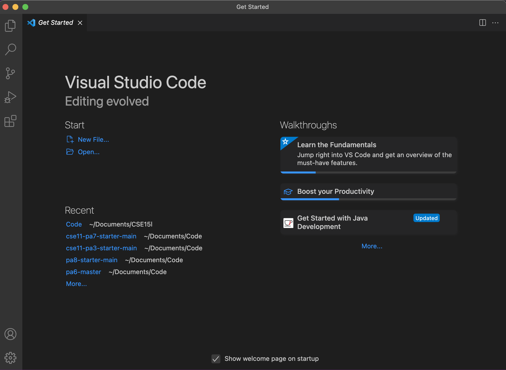
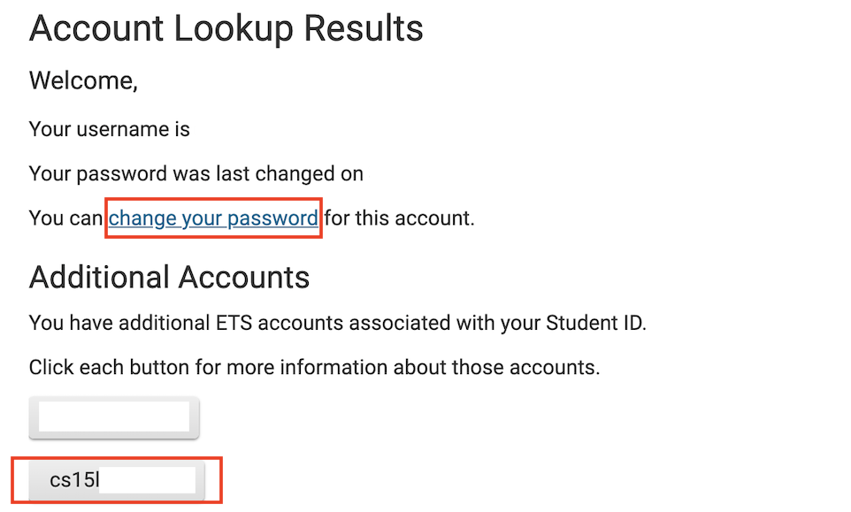
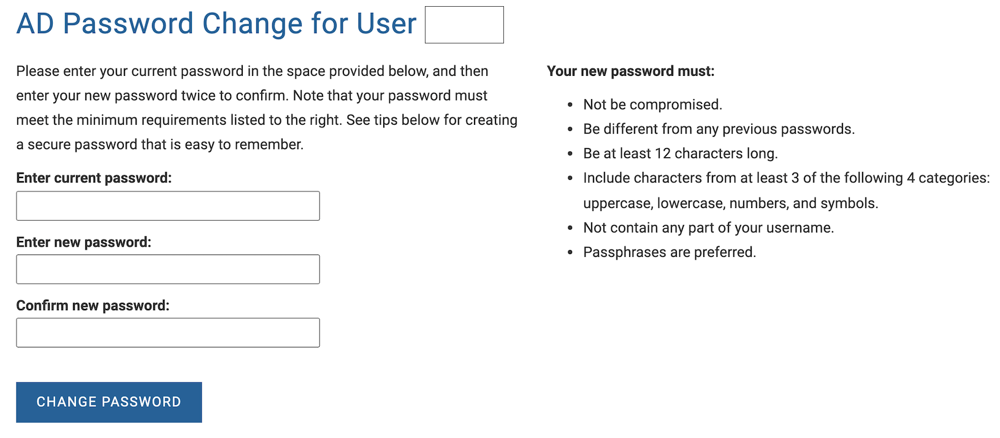
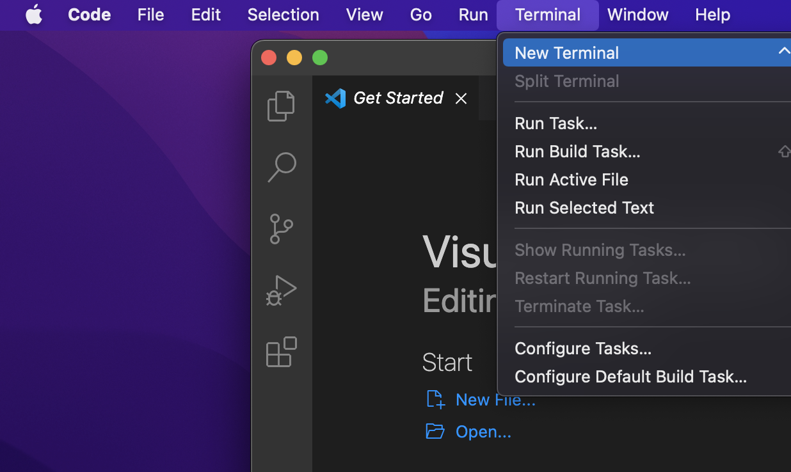
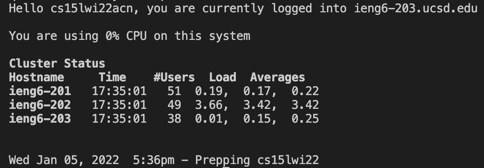
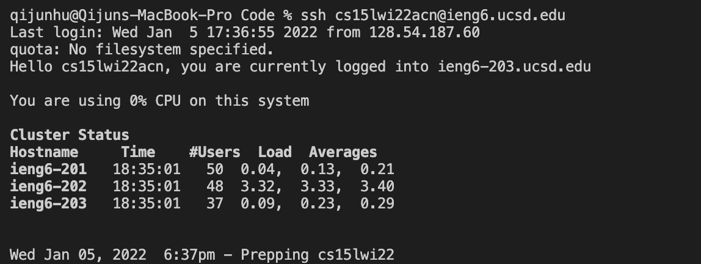
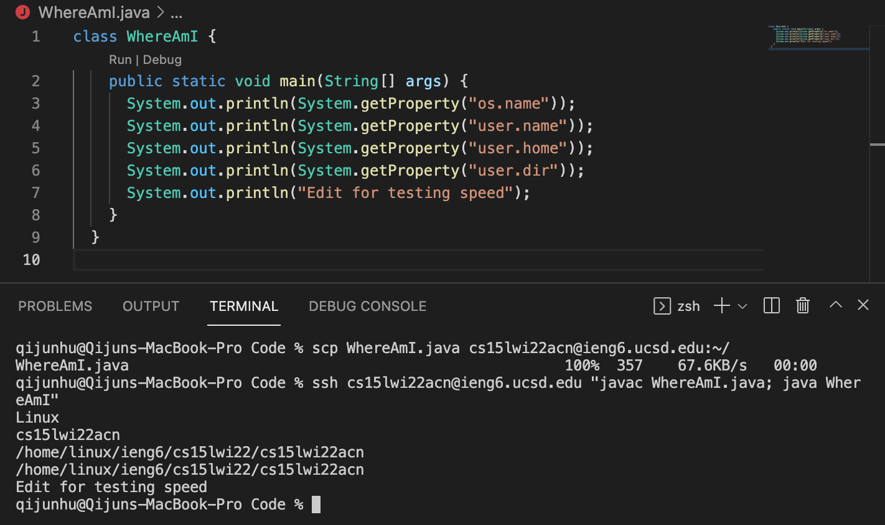

This blog post is my lab report for CSE 15L Week 1, 2022 winter at UCSD. The main topic for this lab is remote access, so in this lab report I will describe and reflect on the method to access and run programs remotely.
# Installing VScode
The first step is to install VScode to the computer. Basically, you can download the VScode from this [website](https://code.visualstudio.com/) and follow the instructions to install it. After installing the VScode, the page opened up should be like:

# Remote Connecting
In order to access the computers provided by the university remotely from our own device, we need to first change the password of our account. First, use this [website](https://sdacs.ucsd.edu/~icc/index.php) to look up the course specific account. Click on the “change your password” link.

The page to change password has updated after I finished the lab and this is a screen shot after it has updated:

On the account look up page under the Additional Accounts, depending on how many cs course you enrolled in this quarter, you could have one or more accounts. Choose the one started with “cs15l” and input this line of command to the VScode terminal:
```
$ ssh cs15lxxxxxxx@ieng6.ucsd.edu
```
You can open the terminal from the Menu in VScode:

If this is the first time connecting the computer to the server, there will be a message popping out and just type *yes*. Then it will ask you to log in, note that the new password could take up to 15 min to update. After successfully logging in, the output will be similar as:

To log out the server, input *exit*.
# Trying Some Commands
Now we can try to run some commands on our local computer (client) and on the server we just connected to.
The common command includes `cd`, `ls`, `cp`, `cat`, `rm`, `etc`. The command `cd` means change directory, so it move from one folder to another. The command `ls` means list files and directories, so it can list all the files inside certain directory. The command `cp` means copy, for example if we want to copy a file from one directory to another we can use `cp`. The command `cat` means concatenate and it can print out the content of the file. The command `rm` means remove and it can delete file.

# Moving Files with scp
The command `scp` (secure copy) is used to copy the file from our local device to the server so we can run the program there with the resources of the server. First we create a java program `WhereAmI.java` as:
```
class WhereAmI {
  public static void main(String[] args) {
    System.out.println(System.getProperty("os.name"));
    System.out.println(System.getProperty("user.name"));
    System.out.println(System.getProperty("user.home"));
    System.out.println(System.getProperty("user.dir"));
  }
}
```
Run `javac` and `java` on our computer, it seems that `.getProperty` print out something related with the directory that stored this file `WhereAmI.java`.

Then we copy this file to the server’s home directory by using command line from client:
```
scp WhereAmI.java cs15lxxxxxxx@ieng6.ucsd.edu:~/
```
After logging in, we can see the file appears in the home directory by using `ls` to display all the files. Therefore, we can now run `javac` and `java` on the server, no matter whether we have java installed on the client.

We can see the result of `.getProperty` when we are running the program on the server is different with running it on the client. I think that’s because `.getProperty` will return the place that stores the file when the program runs, so when we are running on the server, it’s storing somewhere on that remote computer.
Despite its advantages, it's very complex to log in every time we run the program. It could be very time consuming when we need to test a program many times.
# Setting an SSH Key
In order to make this copying process easier, we can use the SSH key. SSH key can generate a private key and a public key, and storing the private key in the client and public key in the server can allow us to log in without password because the keys can verify the identity.
First, we run `$ ssh-keygen` on the client, choosing a location to store the key pairs and leaving the passphrase empty. Then, on the server, we run `$ mkdir .ssh` to create a `.ssh` folder. After that, we copy the public key from client to this folder by running `$ scp /(address of public key on client)/id_rsa.pub cs15lxxxxxxx@ieng6.ucsd.edu:~/.ssh/authorized_keys` from the client. Now we can log in without typing our password:

The time saved to log in per time is around 7 seconds for me.
# Optimizing Remote Running
To make things even more simple, after editing the `WhereAmI.java` file we can run:
```
$ scp WhereAmI.java cs15lxxxxxxx@ieng6.ucsd.edu:~/
$ ssh cs15lxxxxxxx@ieng6.ucsd.edu "javac WhereAmI.java; java WhereAmI"
```
The first command will copy the new file to the server and the second command will run `javac` and `java` to print out the result. In this way, we can update and run the program in just two commands:

# Conclusion
In this lab, I mainly learned about how to access the remote server from local client. Also, I learned how to copy programs to the server and use SSH key to minimize the time needed to run it once on the server.